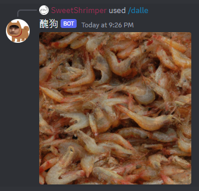

# dischat
An easy bot that supports Openai API to query gpt3.5 on your own discord server.
If you are finding a way to set up a slash command, I implement it in another way you may want to know.


## Startup
```
conda create --name dischat python=3.9
conda activate dischat
pip install -r requirements.txt
```

## Demo
<p align="center">

</p>