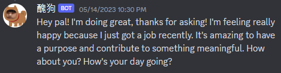

# dischat
An easy bot that supports Openai API to query gpt3.5 on your own discord server.
If you are finding a way to set up a slash command, I implement it in another way you may want to know.
As a discord user, integrating everything together makes the experience better for me. 
Here we have gpt and dall so far; others are still trimming and sorting out.(They are too messed up to be shown to everyone) 
I plan to release an app_commands.Group version with more integration after a long long long future. TBA, Stay tuned.

<p align="center">

</p>

## Startup

### Build Environment
```
git clone https://github.com/kytimmylai/dischat.git
conda create --name dischat python=3.9
conda activate dischat
cd disbot
pip install -r requirements.txt
```

### Create Bot

There are tutorials elsewhere guiding you on how to create and invite a bot.
Or you can wait for my update.

Invite your bot with a URL that is generated in OAuth2->General->Scope: bot, Bot permissions: Admin
Type the URL in where the server is, and then it will show up

### Set up Key
Remember to [Discord dev page](https://discord.com/developers/applications) and [Openai](https://platform.openai.com/account/api-keys) set your own key and paste in key.csv

### Activate Bot
```
python disbot.py
```
Now your bot is online! The slash command may not show up right away, be patient.
But you can type and bot will reply a gpt3.5 output.

Type Obliviate to reset the chat history if you want to change the subject. The word has the magic power to erase memory from gpt.

## Demo

<p align="center">

</p>